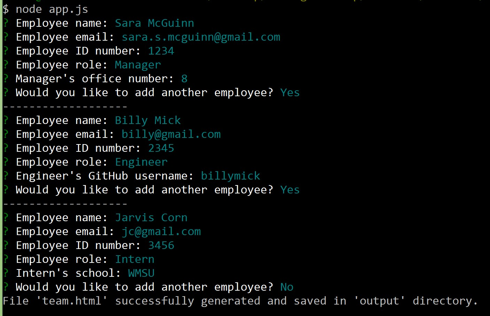
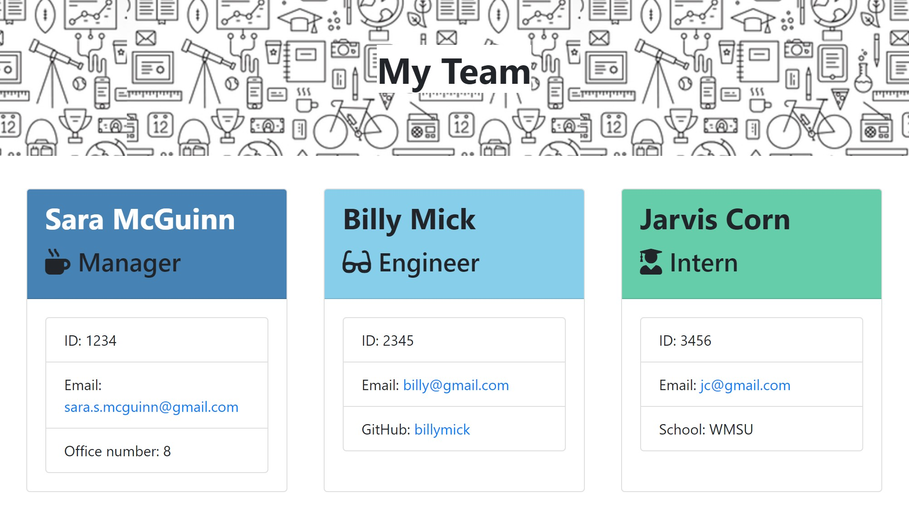

# TeamProfileGenerator
[](https://opensource.org/licenses/MIT)

## Description
This is a software engineering team generator command line application. The application prompts the user for information about the team members. The user can input any number of team members, and they may be a mix of engineers and interns. When the user has completed building the team, the application creates an HTML file that displays a nicely formatted team roster based on the information provided by the user.

Node:



HTML in browser:



For a brief demo video, see https://drive.google.com/file/d/1WLA1wegDDQY8ihx-IRQXdDrlwiXzzsTM/view.

---

## Installation
This application requires Node.js and npm. It uses built-in Node modules `fs` and `path`, and it also requires installation of the `inquirer` module. To install `inquirer`, simply navigate into the directory where the index.js file is saved and type the following into the command line:

```
npm install inquirer --save
```
To run tests, the application will also require installation of the node module `jest`.

---

## Usage
After inquirer is installed, you're ready to go. To run the program in Node, type the following into the command line:

```
node app.js
```

Then type in your answers to the prompts. Once all questions are answered, a team.html file will be generated, populated by your answers. Open the html file in the browser to see all your team members neatly displayed.

---

## Tests 
This application includes files for tests, which are run using `jest`. After installing jest, you can run tests at any time by typing the following into the command line:

```
npm run test
```

---

## Questions
Please feel free to contact me with any questions about this project.

Name: Sara McGuinn

GitHub: saramcguinn

Email: sara.s.mcguinn@gmail.com
